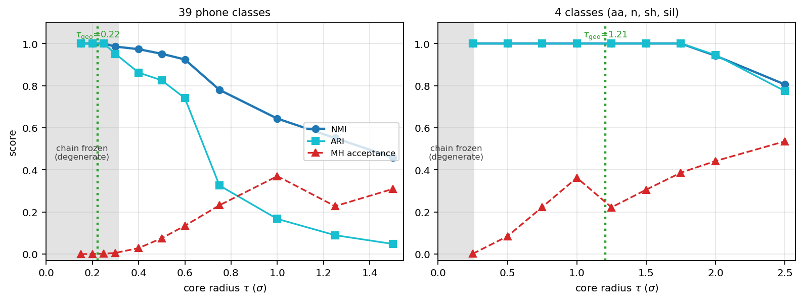
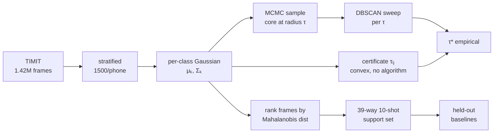
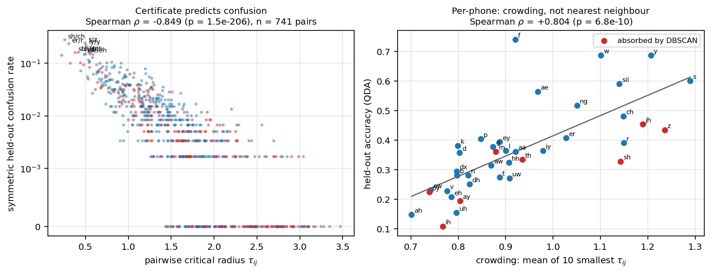
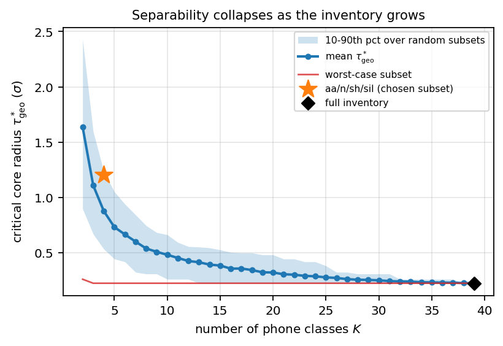

# Speech Work

Unsupervised phone-unit discovery on TIMIT, and where it fails.
Frame-level 12-dim MFCCs, 4,620 utterances, 39 phone classes.

---

## Headline



- DBSCAN can't recover phones from MFCC frames. The cause is **class overlap**, not the algorithm.
- Shrink each class to a Mahalanobis ball of radius `τ` and clustering improves monotonically — but below `τ≈0.25` the sampler freezes at the class mean, so the "perfect" scores there are an artifact.
- **4 classes:** separable at `τ=1.205` with a healthy sampler. **39 classes:** separable only at `τ=0.222`, which is inside the frozen zone. No valid operating point exists.

📄 [**paper.pdf**](paper/paper.pdf) — full write-up, 12 pages

---

## Method



**The certificate.** For two classes, the largest radius at which their cores stay disjoint:

```
τᵢⱼ = min over x of  max( d_M(x, μᵢ; Σᵢ),  d_M(x, μⱼ; Σⱼ) )
```

Convex → unique solution. No clustering, no hyperparameters. `min τᵢⱼ` over pairs = separability of the whole inventory.

---

## Results

**Clustering the real frames** (5 classes, 10k balanced frames)

| method | clusters | coverage | NMI | ARI |
|---|---:|---:|---:|---:|
| DBSCAN | 5 | 0.63 | 0.109 | 0.078 |
| HDBSCAN | 2 | 0.17 | 0.233 | 0.069 |
| DBSCAN +context 132D | 5 | 0.13 | 0.225 | 0.064 |
| OPTICS | 0 | 0.00 | 0.000 | 0.000 |
| **GMM** | 5 | 1.00 | **0.555** | **0.525** |

Density methods trade coverage for purity and never get both. A parametric model beats all of them.

**Core radius sweep** (39 classes)

| τ | MH accept | clusters | NMI | |
|---:|---:|---:|---:|---|
| 0.15 | 0.000 | 39 | 1.000 | ← frozen chain, meaningless |
| 0.25 | 0.002 | 39 | 1.000 | ← frozen chain, meaningless |
| 0.50 | 0.075 | 52 | 0.951 | |
| 0.75 | 0.232 | 54 | 0.780 | |
| 1.50 | 0.309 | 343 | 0.459 | |

**Certificate vs. inventory size** — separability collapses as classes are added

| K | 2 | 4 | 8 | 16 | 24 | 39 |
|---|---:|---:|---:|---:|---:|---:|
| τ_geo | 1.64 | 0.88 | 0.54 | 0.35 | 0.29 | 0.222 |

**Held-out, 39-way, 11,700 unseen frames** (no learned parameters)

| classifier | acc |
|---|---:|
| nearest prototype (Euclidean) | 0.277 |
| nearest class mean | 0.297 |
| min Mahalanobis | 0.335 |
| **Gaussian log-lik (QDA)** | **0.368** |
| chance | 0.026 |

---

## The certificate predicts real confusions



- **ρ = −0.849** (p≈10⁻²⁰⁶) across all 741 phone pairs vs. held-out confusion.
- 14 of the 20 tightest pairs are among the 20 most-confused.
- Hardest pairs: `ay/aw` `sh/ch` `er/r` `ow/oy` `sh/jh` `s/z` `f/th`
- Per-phone accuracy tracks **crowding** (mean of 10 smallest τᵢⱼ, ρ=+0.80), *not* the nearest rival (ρ=0.13, n.s.).



---

## Repo

| dir | |
|---|---|
| [`notebooks/`](notebooks) | 15 notebooks, numbered in the order they were run |
| [`analysis/`](analysis) | certificate, τ-sweep, held-out eval, figures |
| [`paper/`](paper) | `paper.tex`, `paper.pdf`, figures |
| [`reports/`](reports) | progress reports, Apr 2026 |
| [`artifacts/`](artifacts) | `support_set_40phone.pkl` — 390 prototypes + 39 class Gaussians |
| `data/` | not tracked, see [`data/README.md`](data/README.md) |

## Order of work

| # | notebook | outcome |
|---|---|---|
| 00–01 | starter, EDA | 1.42M labelled frames, `sil` = 26% |
| 02–05 | DBSCAN, all phones | ~90% of frames → noise |
| 06–09 | 5 phones; HDBSCAN / OPTICS / context / GMM | best NMI 0.555, from GMM |
| 10 | 4 phones, raw | NMI 0.309, one mixed cluster |
| 11 | 4 phones, MCMC cores | NMI **0.999** — tails were the problem |
| 12 | 39 phones, τ sweep | τ=1.5 fails, τ=0.5 looks good but isn't |
| 13–14 | support set | 39-way 10-shot, episodic baselines |

## Reproduce

```bash
python analysis/01_geometric_certificate.py     # 741 pairs, ~1 min, needs only the pickle
python analysis/02_tau_sweep.py                 # MCMC + DBSCAN sweep
SPEECH_DATA=/path/to/data python analysis/03_heldout_eval.py
python analysis/04_figures.py && python analysis/05_pair_level_validation.py
cd paper && tectonic paper.tex
```

---

## Next

**Corrections to carry forward** — the earlier "39 clusters recovered at τ=0.5" is grid-sensitive (a finer ε grid gives 52). Earlier few-shot numbers drew queries from the support pool; with held-out queries 5-way 1-shot is 0.589, not 0.807.

**To study**

- *Signal* — source–filter model, STFT & filterbanks, cepstra, LPC, F0, VAD
- *Acoustic modelling* — GMM-HMM & forced alignment, CTC, seq2seq, RNN-T, Whisper, decoding, proper evaluation
- *Learned representations* — wav2vec 2.0, HuBERT, WavLM; layer-wise probing; few-shot; multilingual & code-switching; neural TTS
- *Efficiency* — PTQ vs QAT, per-channel scales, pruning, distillation, export & honest RTF/memory measurement
- *Ethics* — voice privacy, cloning consent, checkpoint licensing

**Research directions**

1. **What does compression destroy?** Quantize an SSL encoder; track the certificate, few-shot accuracy and error rate together. Hypothesis: fine contrasts (sibilants, diphthongs) collapse before WER moves, and the damage localises to specific layers.
2. **Certificate on learned features** — recompute on wav2vec2/HuBERT layers; use it as a layer-selection criterion. The control experiment the paper is missing.
3. **Lightweight Indic speech on edge** — per-module quantization sensitivity for a compact TTS, keeping duration/pitch/vocoder heads at higher precision, scored on prosody not file size.
